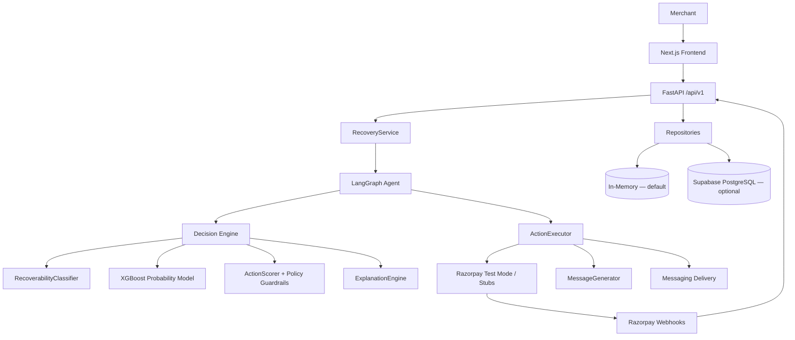
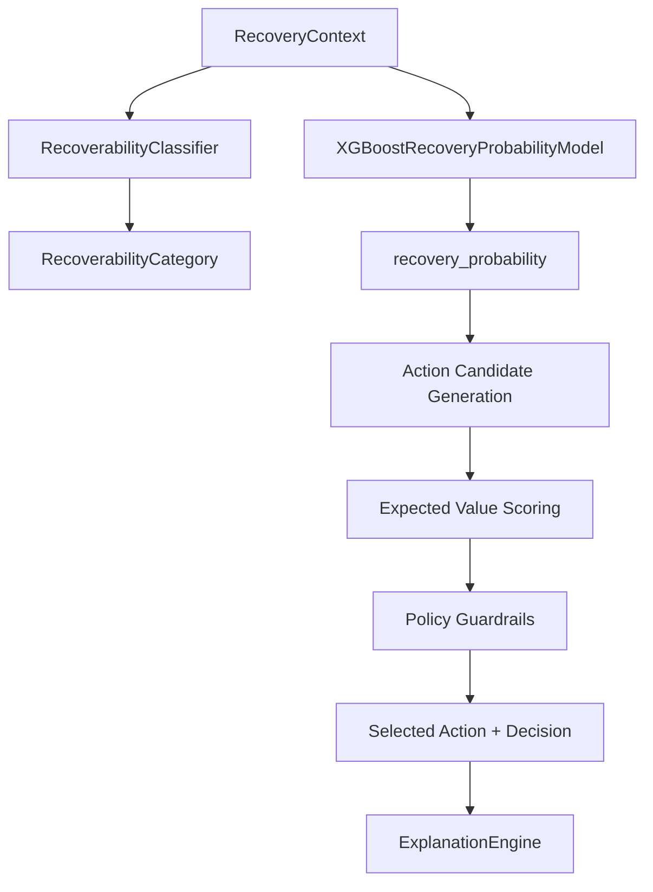
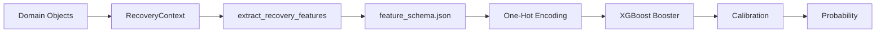
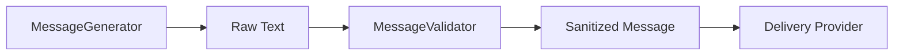
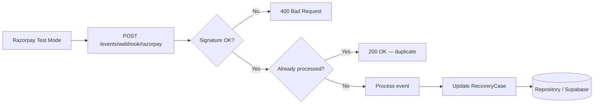
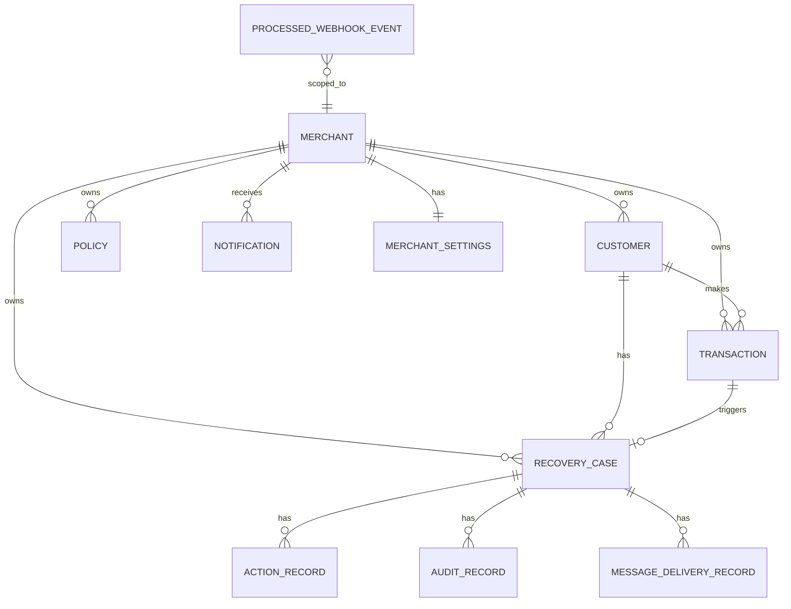
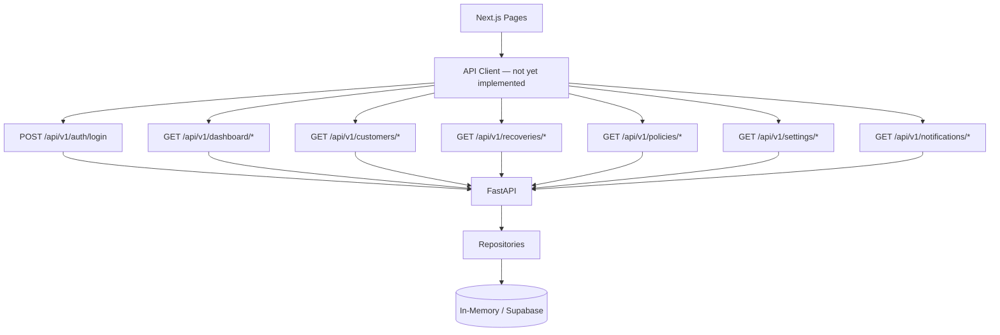
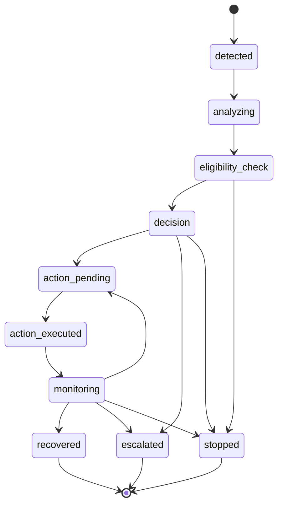

# PayBack

PayBack is a payment-recovery platform that detects failed payments, evaluates recoverability, predicts recovery probability, chooses an appropriate recovery action, communicates with the customer, monitors the outcome, and records recovered revenue.

**Core business flow:**

```
Failed payment → intelligent recovery decision → action → payment outcome → recovered revenue
```

PayBack serves two audiences:

| Audience | Experience |
|----------|------------|
| **Merchant** | Operates PayBack through the Next.js dashboard — views recoveries, customers, policies, analytics, and case timelines |
| **Customer** | Interacts through payment/recovery channels — payment links, email, or WhatsApp messages sent by PayBack (not the dashboard) |

The backend (FastAPI) is the source of truth for recovery logic. The frontend is a merchant-facing UI; customers never log into it.

---

## Table of Contents

- [Core Workflow](#core-workflow)
- [Architecture](#architecture)
- [Architecture Layers](#architecture-layers)
- [Recovery Decision Architecture](#recovery-decision-architecture)
- [ML System](#ml-system)
- [ML Feature Pipeline](#ml-feature-pipeline)
- [Customer History](#customer-history)
- [LLM Architecture](#llm-architecture)
- [Messaging](#messaging)
- [Razorpay Integration](#razorpay-integration)
- [Supabase / Database](#supabase--database)
- [Database Relationships](#database-relationships)
- [Multi-Tenancy](#multi-tenancy)
- [Authentication](#authentication)
- [API Documentation](#api-documentation)
- [API Architecture](#api-architecture)
- [Frontend](#frontend)
- [Frontend ↔ Backend Integration](#frontend--backend-integration)
- [Recovery UI Flow](#recovery-ui-flow)
- [State Machine](#state-machine)
- [Action Execution](#action-execution)
- [Observability](#observability)
- [Idempotency](#idempotency)
- [Background Execution](#background-execution)
- [Testing](#testing)
- [Development Setup](#development-setup)
- [Environment Variables](#environment-variables)
- [Project Structure](#project-structure)
- [Security](#security)
- [Cost / Development Model](#cost--development-model)
- [Current Project Status](#current-project-status)
- [Limitations](#limitations)
- [Roadmap](#roadmap)
- [Further Reading](#further-reading)

---

## Core Workflow

The end-to-end recovery loop implemented in this repository:

1. **Payment attempt occurs** — a transaction is created with status `failed`, `abandoned`, or `pending`.
2. **Payment failure is detected** — via `POST /api/v1/events/payment` (or legacy equivalent).
3. **Transaction and recovery case are created** — `RecoveryService.ingest_payment_event()` persists customer, transaction, and a `RecoveryCase` in status `detected`.
4. **Customer and historical context are assembled** — `recovery_context_from_domain()` queries repositories and builds a `RecoveryContext`.
5. **Recoverability is classified** — `RecoverabilityClassifier` applies deterministic rules (opt-out, failure type, payment history).
6. **XGBoost predicts recovery probability** — `XGBoostRecoveryProbabilityModel` runs calibrated inference on the feature vector.
7. **Expected-value / action scoring** — `ActionScorer` generates candidates and computes `EV = probability × amount − action_cost`.
8. **Policy guardrails are applied** — retry limits, message limits, recovery window, high-value escalation, UPI retry restrictions.
9. **A deterministic explanation is generated** — `ExplanationEngine` produces an auditable reason string.
10. **Recovery action is selected** — highest eligible EV wins; hard stops and escalations override ranking.
11. **Message may be generated** — configured `MessageGenerator` (Ollama / Hugging Face / Mock) drafts customer-facing copy.
12. **Message is validated** — `MessageValidator` enforces financial accuracy, removes placeholders, and adds opt-out text.
13. **Action is executed** — payment link (Razorpay Test Mode or stub), email, WhatsApp, escalate, or stop via `ActionExecutor`.
14. **Recovery is monitored** — case transitions to `monitoring`; LangGraph workflow completes.
15. **Razorpay webhook reports outcome** — `payment_link.paid` / `payment.captured` triggers case recovery.
16. **State is persisted** — in-memory repositories (default) or Supabase PostgreSQL when configured.
17. **Merchant dashboard reflects the result** — via API when integrated; currently the frontend uses mock data (see [Frontend](#frontend)).

**Trigger recovery workflow explicitly:**

```
POST /api/v1/recoveries          (or legacy POST /api/v1/recovery)
```

This invokes the LangGraph agent: `analyze → check_eligibility → decide → execute_action → monitor`.

---

## Architecture



---

## Architecture Layers

| Layer | Directory | Responsibility | Must NOT |
|-------|-----------|----------------|----------|
| **Presentation / API** | `backend/app/api/`, `backend/app/api/v1/` | HTTP routing, request validation, auth dependency injection, response schemas | Contain business rules or direct DB access |
| **Application / Service** | `backend/app/services/recovery.py`, `backend/app/services/notifications.py` | Orchestrate recovery lifecycle, audit trail, webhook handling | Make ML or policy decisions independently |
| **Agent / Orchestration** | `backend/app/agent/` | LangGraph workflow, state transitions, node routing | Bypass the decision engine or state machine |
| **Domain / Core** | `backend/app/core/` | Decision engine, recoverability, probability interface, action scoring, state machine, auth, idempotency | Call external APIs directly |
| **Models** | `backend/app/models/domain.py` | Pydantic v2 domain models and enums | Contain persistence logic |
| **Repositories** | `backend/app/repositories/` | Data access abstraction (`InMemory*` and `Supabase*`) | Encode recovery business rules |
| **ML** | `backend/app/services/ml/`, `ml/` | Feature extraction, XGBoost inference, calibration, customer history | Select actions or override policies |
| **LLM** | `backend/app/services/llm/` | Message generation abstraction | Calculate probability, select actions, or override policies |
| **Messaging** | `backend/app/services/messaging/` | Delivery provider abstraction (mock, SMTP, WhatsApp API) | Generate message content |
| **Actions / Providers** | `backend/app/services/actions/`, `backend/app/services/razorpay/` | Razorpay payment links, stubs, webhook verification | Make recovery decisions |
| **Evaluation** | `backend/app/evaluation/` | Synthetic benchmark datasets, strategy comparison (offline) | Run in production request path |
| **Frontend** | `frontend/` | Merchant dashboard UI, demo auth session | Connect directly to Supabase with privileged credentials |

---

## Recovery Decision Architecture



**Expected value formula** (from `backend/app/core/action_scoring.py`):

```
EV = probability × amount_at_risk − action_cost
```

Each action candidate also applies a conversion weight to the base ML probability (e.g. WhatsApp × 0.90, email × 0.70) before computing EV.

**Why guardrails remain authoritative:**

- ML predicts **probability of recovery** — it does not decide whether an action is permitted.
- Hard stops (opt-out, window expired, max retries, max messages, non-recoverable classification) execute **before** EV ranking.
- High-value and human-approval policies force **escalation** regardless of probability.
- UPI direct retry is blocked by policy even when probability is high.
- Ineligible candidates are excluded from ranking; ML cannot override these rules.

---

## ML System

PayBack uses an XGBoost binary classifier (`payback-recovery-v3`) trained on **synthetic data only**. The model is **not production-validated** on real merchant outcomes.

### Training workflow

There is **no Kaggle integration** in this repository. Training is documented in:

| Path | Purpose |
|------|---------|
| `ml/notebooks/recovery-probability-model-v3.ipynb` | Notebook-based training pipeline |
| `ml/data/synthetic_recovery_cases.csv` | Exported synthetic training dataset |
| `backend/app/evaluation/synthetic.py` | Runtime synthetic case generator for benchmarks |

**Dataset split** (from `ml/artifacts/model_metadata.json`):

| Split | Cases |
|-------|-------|
| Total synthetic | 100,000 |
| Train | 70,000 |
| Validation | 15,000 |
| Test | 15,000 |
| Manual review cases | 50 |

Metadata flags: `"synthetic_only": true`, `"production_performance_claim": false`.

### Artifact structure

```
ml/
├── artifacts/
│   ├── calibration.json       # Sigmoid-on-logit calibration parameters
│   ├── feature_schema.json    # Numeric + categorical feature ordering
│   └── model_metadata.json    # Version, split sizes, training flags
├── data/
│   └── synthetic_recovery_cases.csv
├── models/
│   └── payback_xgboost.json   # Trained XGBoost booster (JSON format)
└── notebooks/
    └── recovery-probability-model-v3.ipynb
```

### Inference path

```
RecoveryContext
  → XGBoostRecoveryProbabilityModel._map_context_to_features()
  → FeatureAdapter.transform_single()
  → XGBoostRecoveryPredictor.predict_probability()
  → sigmoid-on-logit calibration
  → float ∈ [0.0, 1.0]
```

Inference is **deterministic**: identical context produces identical probability. No network calls during prediction.

### Runtime dependencies

XGBoost and NumPy are used at inference time but are **not listed** in `backend/requirements.txt`. Install separately for ML-enabled runs:

```bash
pip install xgboost numpy
```

---

## ML Feature Pipeline



### Feature table

| Feature | Source | Notes |
|---------|--------|-------|
| `amount` | Transaction | Amount at risk in INR |
| `retry_count` | RecoveryCase | Recovery retries attempted |
| `messages_sent` | RecoveryCase | Maps from `message_count` |
| `opted_out` | Customer | 0/1 binary |
| `payment_method` | Transaction | One-hot: upi, card, netbanking, wallet |
| `failure_type` | Transaction.failure_reason | Keyword-mapped to ML categories |
| `customer_tenure_days` | Customer.created_at | Days since account creation |
| `previous_transactions` | Repository query | Count before current transaction |
| `historical_success_rate` | Repository query | Success / total prior transactions |
| `previous_failures` | Repository query | Failed transactions before current |
| `previous_recoveries` | Repository query | Recovered cases before current |
| `prior_recovery_rate` | Derived | recoveries / (failures + recoveries) |
| `customer_history_strength` | Derived | log-scaled history depth |
| `days_since_failure` | Derived | Elapsed since transaction.created_at |
| `checkout_intent_score` | **Placeholder** | Fixed at `0.5` — no telemetry captured |
| `high_value` | Derived | 1 if amount ≥ ₹10,000 |

**Development-only / unavailable features:**

- `checkout_intent_score` — explicitly documented placeholder; PayBack does not capture checkout intent telemetry.
- `payment_method` values `emi` and `unknown` map to all-zero one-hot columns (no ML category).
- Model trained entirely on synthetic data; real-world feature distributions may differ.

---

## Customer History

Customer history features are computed in `backend/app/services/ml/customer_history.py` via repository queries.

| Feature | Calculation |
|---------|-------------|
| `customer_tenure_days` | `(reference_dt − customer.created_at)` in days |
| `previous_transactions` | `transaction_repo.count_by_customer_before(customer.id, reference_dt)` |
| `historical_success_rate` | successful / previous_transactions (0 if none) |
| `previous_failures` | `transaction_repo.count_failed_by_customer_before(...)` |
| `previous_recoveries` | `case_repo.count_recovered_by_customer_before(...)` |
| `prior_recovery_rate` | recoveries / (failures + recoveries) |
| `customer_history_strength` | `clip(log1p(previous_transactions) / log1p(40), 0, 1)` |

**Temporal rule:** `reference_dt` is set to `transaction.created_at`. Only events **strictly before** that timestamp are counted, preventing the current transaction from contaminating historical features.

Repository methods used (defined in `backend/app/repositories/interfaces.py`):

- `count_by_customer_before`
- `count_successful_by_customer_before`
- `count_failed_by_customer_before`
- `count_recovered_by_customer_before`

---

## LLM Architecture

Message generation is separated from decision-making.



### Provider abstraction

| Provider | Config value | Use case |
|----------|--------------|----------|
| **Ollama** | `LLM_PROVIDER=ollama` | Local development (default) |
| **Hugging Face** | `LLM_PROVIDER=huggingface` | Cloud inference when API key is set |
| **Mock** | `LLM_PROVIDER=mock` | Tests and offline execution |

Factory: `backend/app/services/llm/factory.py`

### What the LLM does NOT do

- Calculate recovery probability
- Select the recovery action
- Override merchant policies
- Determine financial values (amounts, links must match context)

### Validation layer

`MessageValidator` (`backend/app/services/llm/validator.py`):

- Rejects unresolved placeholders (`[...]`, `{{...}}`, `TODO`)
- Rejects unsupported claims (invented order details, discounts, etc.)
- Verifies payment link integrity (exact link match, no invented URLs)
- Adds mandatory WhatsApp opt-out text: `"Reply STOP to opt out."`
- Falls back to deterministic safe templates on validation failure

---

## Messaging

Generation and delivery are intentionally split.

| Concern | Module | Responsibility |
|---------|--------|----------------|
| **Generation** | `backend/app/services/llm/` | Draft message content from `MessageContext` |
| **Delivery** | `backend/app/services/messaging/` | Send via configured channel provider |

### Delivery providers

| Provider | Config | Behavior without credentials |
|----------|--------|------------------------------|
| **Mock** | `MESSAGE_DELIVERY_PROVIDER=mock` (default) | Simulated delivery, logs only |
| **Email (SMTP)** | `MESSAGE_DELIVERY_PROVIDER=smtp` | Simulated delivery when SMTP not configured |
| **WhatsApp API** | `MESSAGE_DELIVERY_PROVIDER=whatsapp` | Simulated delivery when API URL/token not configured |

Delivery records are persisted in `MessageDeliveryRecord` when a repository is available.

**Note:** The current `ActionExecutor` routes message actions through `StubMessagingProvider` for action execution; the separate `DeliveryProviderAdapter` layer exists for Phase 4 delivery abstraction. Real external delivery requires provider credentials and wiring.

---

## Razorpay Integration

PayBack integrates with **Razorpay Test Mode only**. Live keys (`rzp_live_`) are rejected at startup and runtime via `LiveKeyForbiddenError`.

### Capabilities

| Feature | Implementation |
|---------|----------------|
| Payment link creation | `RazorpayPaymentProvider.create_payment_link()` |
| Webhook endpoint | `POST /api/v1/events/webhook/razorpay` |
| Signature verification | HMAC-SHA256 when `RAZORPAY_WEBHOOK_SECRET` is set |
| Duplicate protection | `IdempotencyGuard` + `processed_webhook_events` |
| Recovery update | `RecoveryService.mark_case_recovered()` on `payment_link.paid` |

### Webhook flow



### Safety safeguards

- Keys must start with `rzp_test_`
- `settings.validate_razorpay_test_mode()` rejects live keys
- Without configured keys, `StubPaymentProvider` simulates payment links locally
- No real money is charged in the default development configuration

---

## Supabase / Database

PayBack supports **in-memory repositories** (default) and **Supabase PostgreSQL** (optional). Schema is split across:

- `data/schemas/supabase.sql` — Phase 2 core tables
- `supabase/migrations/001_phase4_production_readiness.sql` — Phase 4 extensions

### Tables

| Table | Purpose | Key relationships |
|-------|---------|-------------------|
| `merchants` | Tenant workspace | Parent of all merchant-scoped data |
| `merchant_settings` | Notification preferences | `merchant_id → merchants.id` |
| `customers` | Merchant's end customers | `merchant_id` (nullable for legacy rows) |
| `transactions` | Payment events | `customer_id → customers.id` |
| `recovery_cases` | Recovery opportunities | `transaction_id`, `customer_id` |
| `action_records` | Executed recovery actions | `recovery_case_id → recovery_cases.id` |
| `audit_records` | Chronological audit trail | `recovery_case_id → recovery_cases.id` |
| `policies` | Merchant recovery limits | `merchant_id`, retry/message/window thresholds |
| `message_delivery_records` | Outbound message tracking | `recovery_case_id`, `customer_id` |
| `notifications` | Merchant inbox events | `merchant_id`, optional `recovery_case_id` |
| `processed_webhook_events` | Webhook idempotency | Unique `(provider, provider_event_id)` |

### Repository mapping

When Supabase is active, these entities use Supabase REST repositories:

- customers, transactions, recovery_cases, action_records, audit_records, policies

These remain **in-memory even when Supabase is configured**:

- merchants, merchant_settings, notifications, message_delivery_records, processed_webhook_events

Supabase activates when `SUPABASE_URL` + key are set **and** `PAYBACK_ENV=production`, or when `database_mode=supabase` is present on settings (see factory; not exposed in `.env.example`).

Row Level Security (RLS) is enabled in the Phase 4 migration. Backend uses `service_role` key which bypasses RLS; authenticated JWT scoping is intended for direct client access.

---

## Database Relationships



---

## Multi-Tenancy

Phase 4 introduces merchant isolation across three layers:

1. **Authentication** — JWT carries `merchant_id` claim; `get_current_merchant` dependency resolves tenant identity.
2. **Application layer** — v1 API endpoints filter by `merchant.id`; cross-tenant access returns `403`.
3. **Repository layer** — `list_by_merchant()` methods scope queries.
4. **Database layer** — RLS policies on Supabase tables (when using authenticated client access).

**Important:** Security must not rely on frontend UI filtering. All v1 merchant endpoints use `Depends(get_current_merchant)` and repository-level scoping.

Legacy Phase 2 routes (`backend/app/api/routes.py`) do **not** enforce merchant isolation.

---

## Authentication

| Aspect | Implementation |
|--------|----------------|
| Token format | RFC 7519 JWT, HS256 (`backend/app/core/auth.py`) |
| Provider | `SupabaseJWTAuthProvider` — zero-dependency HMAC implementation |
| Supabase Auth compatibility | Same HS256 verification; works with Supabase-issued tokens when secret matches |
| Default mode | `AUTH_ENABLED=false` — unauthenticated requests receive a default test merchant |
| Dev fallback | `X-Merchant-ID` header or `DEFAULT_TEST_MERCHANT` (`merchant_default`) |
| Registration | `POST /api/v1/auth/register` — creates merchant, returns JWT |
| Login | `POST /api/v1/auth/login` — **does not verify passwords**; creates merchant if email unknown |

### Development vs production

| Setting | Development (default) | Production intent |
|---------|----------------------|-------------------|
| `AUTH_ENABLED` | `false` | `true` |
| `JWT_SECRET_KEY` | Dev default string | Strong secret required |
| Password verification | Not implemented | Would need Supabase Auth or credential store |
| Merchant resolution | Default test merchant | Bearer token required |

The frontend currently uses **localStorage demo sessions** (`frontend/lib/demo-session.ts`) and does not call the auth API.

---

## API Documentation

Base URL: `http://localhost:8000`

Modular v1 routes are mounted under `/api/v1`. Legacy routes remain at `/api/v1` via `backend/app/api/routes.py` for backward compatibility.

### Authentication

| Method | Endpoint | Purpose | Auth | Notes |
|--------|----------|---------|------|-------|
| POST | `/api/v1/auth/register` | Register merchant | None | Returns JWT |
| POST | `/api/v1/auth/login` | Login merchant | None | No password check |
| GET | `/api/v1/auth/me` | Current merchant profile | Bearer / dev fallback | |

### Dashboard

| Method | Endpoint | Purpose | Auth |
|--------|----------|---------|------|
| GET | `/api/v1/dashboard/summary` | Aggregate recovery metrics | Bearer / dev |
| GET | `/api/v1/dashboard/trends` | Time-series recovery data | Bearer / dev |
| GET | `/api/v1/dashboard/breakdown` | Breakdown by action, status, payment method | Bearer / dev |

### Customers

| Method | Endpoint | Purpose | Auth |
|--------|----------|---------|------|
| GET | `/api/v1/customers` | List customers | Bearer / dev |
| GET | `/api/v1/customers/{id}` | Customer detail | Bearer / dev |
| GET | `/api/v1/customers/{id}/payments` | Customer transactions | Bearer / dev |
| GET | `/api/v1/customers/{id}/recoveries` | Customer recovery cases | Bearer / dev |

### Recoveries

| Method | Endpoint | Purpose | Auth |
|--------|----------|---------|------|
| GET | `/api/v1/recoveries` | List recovery cases | Bearer / dev |
| GET | `/api/v1/recoveries/{id}` | Get case | Bearer / dev |
| POST | `/api/v1/recoveries` | Start recovery workflow | Bearer / dev |
| GET | `/api/v1/recoveries/{id}/actions` | Action history | Bearer / dev |
| GET | `/api/v1/recoveries/{id}/timeline` | Audit timeline | Bearer / dev |
| GET | `/api/v1/recoveries/{id}/audit` | Alias for timeline | Bearer / dev |
| GET | `/api/v1/recoveries/{id}/messages` | Message delivery records | Bearer / dev |

Legacy aliases: `/api/v1/recovery/*` mirrors `/api/v1/recoveries/*`.

### Policies

| Method | Endpoint | Purpose | Auth |
|--------|----------|---------|------|
| GET | `/api/v1/policies` | List policies | Bearer / dev |
| GET | `/api/v1/policies/active` | Active policy | Bearer / dev |
| GET | `/api/v1/policies/{id}` | Get policy | Bearer / dev |
| POST | `/api/v1/policies` | Create policy | Bearer / dev |
| PUT | `/api/v1/policies/{id}` | Update policy | Bearer / dev |

### Settings

| Method | Endpoint | Purpose | Auth |
|--------|----------|---------|------|
| GET | `/api/v1/settings/profile` | Merchant profile | Bearer / dev |
| PUT | `/api/v1/settings/profile` | Update profile | Bearer / dev |
| GET | `/api/v1/settings/notifications` | Notification preferences | Bearer / dev |
| PUT | `/api/v1/settings/notifications` | Update preferences | Bearer / dev |

### Notifications

| Method | Endpoint | Purpose | Auth |
|--------|----------|---------|------|
| GET | `/api/v1/notifications` | List notifications | Bearer / dev |
| GET | `/api/v1/notifications/unread-count` | Unread count | Bearer / dev |
| PATCH | `/api/v1/notifications/{id}/read` | Mark as read | Bearer / dev |

### Events

| Method | Endpoint | Purpose | Auth |
|--------|----------|---------|------|
| POST | `/api/v1/events/payment` | Ingest payment failure | Bearer / dev (v1) / None (legacy) |

### Webhooks

| Method | Endpoint | Purpose | Auth |
|--------|----------|---------|------|
| POST | `/api/v1/events/webhook/razorpay` | Razorpay webhook receiver | Signature header |

### Health

| Method | Endpoint | Purpose | Auth |
|--------|----------|---------|------|
| GET | `/health` | Liveness probe | None |
| GET | `/ready` | Readiness + dependency status | None |
| GET | `/api/v1/health` | Liveness (v1 prefix) | None |
| GET | `/api/v1/ready` | Readiness (v1 prefix) | None |

### Legacy routes (backward compatible)

| Method | Endpoint | Notes |
|--------|----------|-------|
| POST | `/api/v1/recovery` | Same as `POST /api/v1/recoveries` |
| GET | `/api/v1/recovery/{id}` | No merchant isolation |
| GET | `/api/v1/recovery/{id}/actions` | No merchant isolation |
| GET | `/api/v1/recovery/{id}/audit` | No merchant isolation |

Interactive API docs: `http://localhost:8000/docs`

---

## API Architecture

```
backend/app/api/
├── routes.py              # Legacy Phase 2 router (mounted at /api/v1)
├── errors.py              # Structured JSON exception handlers
├── middleware.py          # Correlation ID middleware
├── schemas.py             # Request/response Pydantic schemas
└── v1/
    ├── auth.py
    ├── customers.py
    ├── dashboard.py
    ├── events.py
    ├── health.py
    ├── notifications.py
    ├── policies.py
    ├── recoveries.py
    ├── settings.py
    └── webhooks.py
```

`backend/app/main.py` mounts:

- Root health probes at `/health`, `/ready`
- Legacy router at `/api/v1` (Phase 2 compatibility)
- Modular v1 routers at `/api/v1/*`
- Recovery router at both `/api/v1/recoveries` and `/api/v1/recovery`

New integrations should use modular v1 endpoints with merchant auth. Legacy endpoints remain for existing clients and tests.

---

## Frontend

Stack: **Next.js 16**, **React 19**, **Tailwind CSS 4**, **shadcn/ui**.

```
frontend/
├── app/                   # App Router pages
├── components/
│   ├── payback-app.tsx    # Main dashboard shell + views
│   └── ui/                # shadcn components
├── lib/
│   ├── api/payback.ts     # Types + mock data (current)
│   └── demo-session.ts    # localStorage auth stub
└── public/                # Static assets
```

### Routes

| Route | Purpose |
|-------|---------|
| `/` | Landing page |
| `/sign-in` | Demo sign-in (localStorage session) |
| `/sign-up` | Demo sign-up |
| `/dashboard` | Overview metrics and charts |
| `/recoveries` | Recovery queue |
| `/recoveries/[id]` | Case detail — decision, probability, timeline |
| `/analytics` | Performance analytics |
| `/customers` | Customer list |
| `/customers/[id]` | Customer profile, payments, recoveries |
| `/policies` | Policy management UI |
| `/settings` | Workspace settings |

### Current data architecture

**Mock-data mode (current):** `frontend/lib/api/payback.ts` exports hardcoded customers, recoveries, metrics, and helper functions. No HTTP calls to FastAPI are made.

**Target architecture:**

```
UI components → typed API client → FastAPI /api/v1 → repositories/services → Supabase / providers
```

The frontend must **not** connect directly to Supabase with `service_role` credentials. All privileged data access goes through the FastAPI backend.

---

## Frontend ↔ Backend Integration



| Data domain | Backend source | Frontend status |
|-------------|----------------|-----------------|
| Authentication | `/api/v1/auth/*` | Demo localStorage only |
| Dashboard metrics | `/api/v1/dashboard/*` | Mock static values |
| Customers | `/api/v1/customers/*` | Mock array |
| Recoveries | `/api/v1/recoveries/*` | Mock array |
| Policies | `/api/v1/policies/*` | Static UI cards |
| Settings | `/api/v1/settings/*` | Static UI cards |
| Notifications | `/api/v1/notifications/*` | UI indicator only |

CORS is pre-configured for `http://localhost:3000` in `backend/app/config.py`.

---

## Recovery UI Flow

How the merchant-facing UI exposes backend intelligence (designed mapping; mock data today):

### Recovery case

```
Recoveries list
  → Recovery Detail (/recoveries/[id])
    → PayBack Decision (reason + AI-assisted tag)
    → Recovery Probability (%)
    → Recoverability (via decision reason)
    → Expected Value (backend field: expected_value)
    → Selected Action (nextAction / selected_action)
    → Timeline (audit events)
    → Message Preview (LLM-generated copy)
    → Outcome (status: Recovered / In review / Failed)
```

### Customer profile

```
Customers list
  → Customer Detail (/customers/[id])
    → Payment History
    → Recovery History (linked cases)
    → Activity Timeline
```

When integrated, recovery detail should fetch `GET /api/v1/recoveries/{id}`, `/timeline`, `/actions`, and `/messages` to populate these sections from live backend data.

---

## State Machine

Defined in `backend/app/core/state_machine.py`.

### States

| State | Terminal? | Description |
|-------|-----------|-------------|
| `detected` | No | Case created from failed payment |
| `analyzing` | No | LangGraph analyze node |
| `eligibility_check` | No | Eligibility evaluation |
| `decision` | No | Decision engine ran |
| `action_pending` | No | Action about to execute |
| `action_executed` | No | Action completed |
| `monitoring` | No | Awaiting customer response / webhook |
| `recovered` | **Yes** | Payment recovered |
| `escalated` | **Yes** | Routed to human review |
| `stopped` | **Yes** | Recovery halted (opt-out, limits, etc.) |

### Valid transitions



Invalid transitions raise `InvalidTransitionError` (HTTP 400).

---

## Action Execution

Actions are defined in `RecoveryAction` enum and executed by `ActionExecutor`.

| Action | Provider | Default cost (INR) | Notes |
|--------|----------|-------------------|-------|
| `retry_payment` | Razorpay / stub | 2.0 | Blocked for UPI; limited by max retries |
| `create_payment_link` | Razorpay Test Mode / stub | 5.0 | Primary recovery path for failed payments |
| `send_whatsapp` | Stub + LLM generation | 1.0 | Message validated before send |
| `send_email` | Stub + LLM generation | 0.2 | HTML body validated |
| `escalate` | Stub escalation | 15.0 | Triggered by high value or policy |
| `stop` | N/A | 0.0 | Terminal — no external call |

Action costs are configurable per policy via `Policy.action_costs`.

Selection logic: among eligible candidates, highest `(expected_value, probability)` wins after guardrails pass.

---

## Observability

| Feature | Location | Purpose |
|---------|----------|---------|
| Correlation IDs | `CorrelationIdMiddleware` | `X-Request-ID` on every request/response; included in error JSON |
| Structured errors | `backend/app/api/errors.py` | Consistent `{code, message, request_id}` responses |
| Structured logging | `backend/app/core/logging_config.py` | Timestamped stdout logs with level |
| Secret masking | `SensitiveDataFilter` | Redacts Razorpay keys, Bearer tokens from logs |
| Liveness | `GET /health` | Process alive check |
| Readiness | `GET /ready` | Reports Supabase, Razorpay, LLM, messaging dependency status |

Operators can trace a failing request using `request_id` from error responses and correlate with server logs.

---

## Idempotency

**Problem:** Payment providers may deliver the same webhook or action request multiple times.

**Webhook idempotency:**

1. Extract `provider_event_id` from Razorpay payload (or derive from entity IDs).
2. `IdempotencyGuard.is_event_processed()` checks `processed_webhook_events`.
3. Duplicates return `200 OK` with `is_duplicate: true` — no state change.
4. New events are processed then recorded.

**Action idempotency (background tasks):**

`InMemoryBackgroundExecutor` accepts an `idempotency_key`. Duplicate submissions return the existing task without re-execution.

---

## Background Execution

| Component | Current implementation | Future replacement |
|-----------|----------------------|-------------------|
| Interface | `BackgroundExecutor` ABC | Celery, SQS, or other queue |
| Default | `InMemoryBackgroundExecutor` | Durable distributed executor |
| Execution | `ThreadPoolExecutor` with retries | Persistent job queue |
| Config | `BACKGROUND_EXECUTOR_TYPE=in_memory` | Not yet implemented beyond in-memory |

There is **no Redis, Kafka, or durable queue** in the current codebase.

---

## Testing

**188 tests** collected (verified via `pytest --collect-only`).

```bash
# From repository root
python -m pytest backend/tests -q

# With verbose output
python -m pytest backend/tests -v
```

### Test categories

| Category | Example files |
|----------|---------------|
| Unit — decision engine | `test_decision.py`, `test_intelligence.py` |
| Unit — state machine | `test_state_machine.py` |
| ML — probability interface | `test_ml_probability_interface.py`, `test_ml_integration.py` |
| ML — customer history | `test_customer_history.py` |
| LLM providers | `test_llm_providers.py`, `test_message_generator.py`, `test_message_validator.py` |
| API — Phase 2 legacy | `test_api_phase2.py`, `test_api.py` |
| API — Phase 4 modular | `test_phase4_api.py`, `test_phase4_auth.py`, `test_phase4_tenant_isolation.py` |
| Webhooks | `test_webhook.py`, `test_phase4_idempotency.py` |
| Razorpay safety | `test_razorpay.py`, `test_safety.py` |
| Repositories | `test_repositories.py` |
| Messaging | `test_phase4_messaging.py` |
| End-to-end recovery | `test_end_to_end_recovery.py`, `test_recovery_service.py` |
| Evaluation benchmarks | `test_evaluation.py` |
| Live integration (optional) | `test_live_integration.py` |

### Frontend

```bash
cd frontend
npm install
npm run dev      # http://localhost:3000
npm run build    # production build
```

---

## Development Setup

### Prerequisites

- Python 3.11+
- Node.js 18+ (for frontend)
- Optional: Ollama (local LLM), Supabase project, Razorpay Test Mode keys

### 1. Clone and configure environment

```bash
cp .env.example .env
# Edit .env with your values (all optional for basic local dev)
```

### 2. Backend

```bash
# Install Python dependencies
pip install -r backend/requirements.txt

# ML inference (optional but required for decision engine default model)
pip install xgboost numpy

# Run API server
cd backend
python -m uvicorn app.main:app --reload --host 0.0.0.0 --port 8000
```

API available at `http://localhost:8000/docs`.

### 3. Frontend

```bash
cd frontend
npm install
npm run dev
```

Dashboard at `http://localhost:3000`. Use "Use demo account" on sign-in — no backend required for UI exploration.

### 4. Optional: Ollama (local LLM)

```bash
# Install Ollama, then pull the configured model
ollama pull qwen2.5:3b

# Ensure Ollama is running on localhost:11434
# LLM_PROVIDER=ollama (default)
```

### 5. Optional: Supabase

1. Create a Supabase project (free tier).
2. Run `data/schemas/supabase.sql` then `supabase/migrations/001_phase4_production_readiness.sql`.
3. Set `SUPABASE_URL`, `SUPABASE_SERVICE_ROLE_KEY` in `.env`.
4. Set `PAYBACK_ENV=production` to activate Supabase repositories.

### 6. Optional: Razorpay Test Mode

1. Create Razorpay test credentials (`rzp_test_*`).
2. Set `RAZORPAY_KEY_ID`, `RAZORPAY_KEY_SECRET`, `RAZORPAY_WEBHOOK_SECRET`.
3. Configure webhook URL: `https://your-host/api/v1/events/webhook/razorpay`.

Without Razorpay keys, payment links use `StubPaymentProvider`.

### 7. ML artifacts

Pre-trained artifacts are committed under `ml/`. No retraining required to run inference. To retrain, use `ml/notebooks/recovery-probability-model-v3.ipynb`.

---

## Environment Variables

From `.env.example` and `backend/app/config.py`:

| Variable | Purpose | Required? | Notes |
|----------|---------|-----------|-------|
| `PAYBACK_ENV` | Environment name | No | Default: `development`. Set `production` for Supabase repos |
| `LOG_LEVEL` | Logging verbosity | No | Default: `INFO` |
| `SUPABASE_URL` | Supabase project URL | No | Empty = in-memory |
| `SUPABASE_ANON_KEY` | Supabase anon key | No | |
| `SUPABASE_SERVICE_ROLE_KEY` | Backend DB access | No | Preferred for backend |
| `DATABASE_URL` | Direct Postgres URL | No | Not used by current repository layer |
| `RAZORPAY_KEY_ID` | Razorpay API key | No | Must be `rzp_test_*` |
| `RAZORPAY_KEY_SECRET` | Razorpay API secret | No | |
| `RAZORPAY_WEBHOOK_SECRET` | Webhook HMAC secret | No | Required for signature verification |
| `HUGGINGFACE_API_KEY` | HF inference API | No | Only if `LLM_PROVIDER=huggingface` |
| `HUGGINGFACE_MODEL` | HF model name | No | Default: Mistral-7B-Instruct |
| `LLM_PROVIDER` | LLM backend | No | `ollama` (default), `huggingface`, `mock` |
| `OLLAMA_BASE_URL` | Ollama server URL | No | Default: `http://localhost:11434` |
| `OLLAMA_MODEL` | Ollama model tag | No | Default: `qwen2.5:3b` |
| `AUTH_ENABLED` | Require JWT on protected routes | No | Default: `false` |
| `JWT_SECRET_KEY` | JWT signing secret | No | Change for any shared deployment |
| `JWT_ALGORITHM` | JWT algorithm | No | Default: `HS256` |
| `JWT_ACCESS_TOKEN_EXPIRE_MINUTES` | Token TTL | No | Default: 1440 (24h) |
| `MESSAGE_DELIVERY_PROVIDER` | Delivery backend | No | `mock` (default), `smtp`, `whatsapp` |
| `SMTP_HOST` / `SMTP_PORT` / `SMTP_USER` / `SMTP_PASSWORD` | Email delivery | No | Simulated if incomplete |
| `SMTP_FROM_EMAIL` | Sender address | No | Default: `recovery@payback.ai` |
| `WHATSAPP_API_URL` / `WHATSAPP_API_TOKEN` / `WHATSAPP_FROM_PHONE` | WhatsApp delivery | No | Simulated if incomplete |
| `BACKGROUND_EXECUTOR_TYPE` | Task executor | No | Default: `in_memory` |
| `BACKGROUND_MAX_WORKERS` | Thread pool size | No | Default: 4 |

Never commit real secrets. Use `.env` locally (gitignored).

---

## Project Structure

```
PayBack/
├── backend/
│   ├── app/
│   │   ├── agent/           # LangGraph workflow
│   │   ├── api/             # FastAPI routes (legacy + v1)
│   │   ├── core/            # Decision engine, auth, state machine
│   │   ├── evaluation/      # Synthetic benchmarks
│   │   ├── models/          # Domain models
│   │   ├── repositories/    # In-memory + Supabase adapters
│   │   └── services/        # Recovery, ML, LLM, messaging, Razorpay
│   ├── migrations/          # Phase 4 SQL migration
│   ├── scripts/             # Integration verification scripts
│   ├── tests/               # 188 pytest tests
│   └── main.py              # Uvicorn entry point
├── frontend/                # Next.js merchant dashboard
├── ml/                      # Model artifacts, data, notebooks
├── data/schemas/            # Supabase base schema
├── docs/architecture/       # Phase 2 and Phase 4 architecture notes
├── pyproject.toml           # Python project metadata
└── .env.example             # Environment template
```

| Directory | Description |
|-----------|-------------|
| `backend/app/agent/` | LangGraph graph, nodes, routing, `RecoveryState` |
| `backend/app/core/decision.py` | Full decision pipeline orchestration |
| `backend/app/services/recovery.py` | Application service — ingestion, workflow, webhooks |
| `backend/app/services/ml/` | XGBoost adapter, feature extraction, customer history |
| `frontend/components/payback-app.tsx` | Single-file dashboard application shell |
| `ml/models/payback_xgboost.json` | Committed trained model weights |
| `docs/architecture/overview.md` | Phase 2 architecture reference |
| `docs/architecture/phase4.md` | Phase 4 productionization reference |

---

## Security

| Control | Status |
|---------|--------|
| JWT authentication | Implemented; disabled by default (`AUTH_ENABLED=false`) |
| Merchant isolation | Enforced on v1 API + repository scoping |
| Row Level Security | Defined in migration; backend uses service_role |
| Webhook signature verification | HMAC-SHA256 when secret configured |
| Input validation | Pydantic v2 on all API payloads |
| Secret handling | `.env` gitignored; no secrets in source |
| Error sanitization | Generic 500 messages; no stack traces to client |
| Log masking | Razorpay keys and Bearer tokens redacted |
| Razorpay Test Mode enforcement | Live keys rejected at config and provider init |

Password-based login is **not** implemented. Do not expose the API publicly without enabling auth and securing JWT secrets.

---

## Cost / Development Model

PayBack is designed for **zero-cost local development**:

| Component | Free / local option |
|-----------|---------------------|
| LLM | Ollama locally, or Mock provider |
| Messaging | Mock delivery (default) |
| Database | In-memory repositories (default) |
| Payments | Razorpay Test Mode or stubs |
| Background tasks | In-memory thread pool |
| ML inference | Committed artifacts, no training API calls |

Production deployment would require configuring Supabase, auth secrets, and optionally external messaging providers. That configuration is separate from the default dev setup.

---

## Current Project Status

| Phase | Scope | Status |
|-------|-------|--------|
| **Phase 1** | Project foundation, domain models, basic API | Complete |
| **Phase 2** | Supabase schema, Razorpay Test Mode, webhook loop, LangGraph agent, in-memory repos | Complete |
| **Phase 3** | Decision engine, XGBoost ML, action scoring, LLM providers, message validation, evaluation benchmarks | Complete (ML synthetic-only) |
| **Phase 4** | Auth, multi-tenancy, modular v1 API, idempotency, messaging delivery abstraction, observability, background executor | Backend complete; partial Supabase repo coverage |
| **Frontend** | Merchant dashboard UI | Built and runnable; **mock-data mode** — API integration not wired |

---

## Limitations

| Limitation | Detail |
|------------|--------|
| ML model | Trained and evaluated on synthetic data only; not validated on real merchant outcomes |
| `checkout_intent_score` | Fixed placeholder (0.5); no checkout telemetry pipeline |
| Razorpay | Test Mode only; no live payment processing |
| Messaging | External email/WhatsApp delivery simulated unless credentials configured; action path uses stubs |
| Authentication | Login does not verify passwords; auth disabled by default |
| Supabase coverage | Merchants, notifications, webhook idempotency, message deliveries remain in-memory even with Supabase |
| Frontend | Hardcoded mock data in `frontend/lib/api/payback.ts`; no live API client |
| Background executor | In-memory thread pool only; tasks lost on process restart |
| Dashboard metric | `average_recovery_time_hours` hardcoded to `2.4` in dashboard API |
| XGBoost dependency | Not in `requirements.txt`; must install manually |
| Kaggle | No Kaggle pipeline exists; training is notebook + synthetic CSV based |

---

## Roadmap

Realistic remaining work based on current gaps:

- Wire frontend API client to FastAPI v1 endpoints with JWT auth
- Implement password verification (Supabase Auth or credential store)
- Persist merchants, notifications, and webhook events to Supabase
- Retrain ML model on real recovery outcomes once data is available
- Configure production messaging provider credentials (SMTP, WhatsApp Cloud API)
- Replace in-memory background executor with durable queue when needed
- Remove `checkout_intent_score` placeholder or integrate real intent signals
- Add frontend environment variable for API base URL

---

## Further Reading

- [docs/architecture/overview.md](docs/architecture/overview.md) — Phase 2 recovery loop and API boundaries
- [docs/architecture/phase4.md](docs/architecture/phase4.md) — Phase 4 auth, messaging, idempotency design
- [data/schemas/supabase.sql](data/schemas/supabase.sql) — Base PostgreSQL schema
- [supabase/migrations/001_phase4_production_readiness.sql](supabase/migrations/001_phase4_production_readiness.sql) — Phase 4 migration

---

## Documentation Report

This README was generated from direct repository inspection.

**Sections added:** Product overview, core workflow, architecture, layers, decision pipeline, ML system, feature pipeline, customer history, LLM, messaging, Razorpay, database, ER diagram, multi-tenancy, auth, full API table, API architecture, frontend, integration flow, UI flow, state machine, actions, observability, idempotency, background execution, testing, setup, env vars, project structure, security, cost model, status, limitations, roadmap.

**Diagrams added (6):** High-level architecture, recovery decision pipeline, ML feature pipeline (inline), Razorpay webhook flow, database ER diagram, state machine.

**Tables added:** Architecture layers, ML features, ML artifacts, customer history, LLM providers, messaging providers, database tables, API endpoints, recovery actions, observability, environment variables, project structure, security controls, project status, limitations.

**Repository areas inspected:** `backend/app/` (api, agent, core, models, repositories, services, evaluation), `backend/tests/`, `supabase/migrations/`, `ml/`, `frontend/`, `docs/`, `data/schemas/`, `pyproject.toml`, `backend/requirements.txt`, `frontend/package.json`, `.env.example`.

**Claims intentionally omitted:**

- Kaggle training workflow (not present in repository)
- Redis, Kafka, API Gateway, microservices, separate auth service
- "Production-ready", "enterprise-grade", "fully scalable", "real-time" claims
- Live Razorpay / live money processing
- Production-validated ML performance
- Real WhatsApp/email delivery as default behavior
- Password-authenticated login
- Frontend ↔ backend live integration (not yet implemented)
