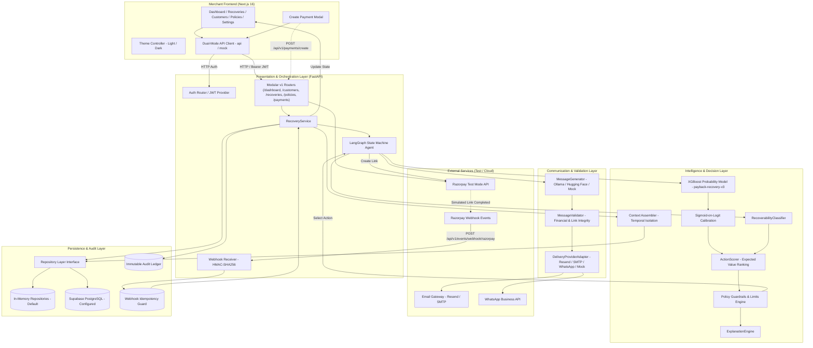
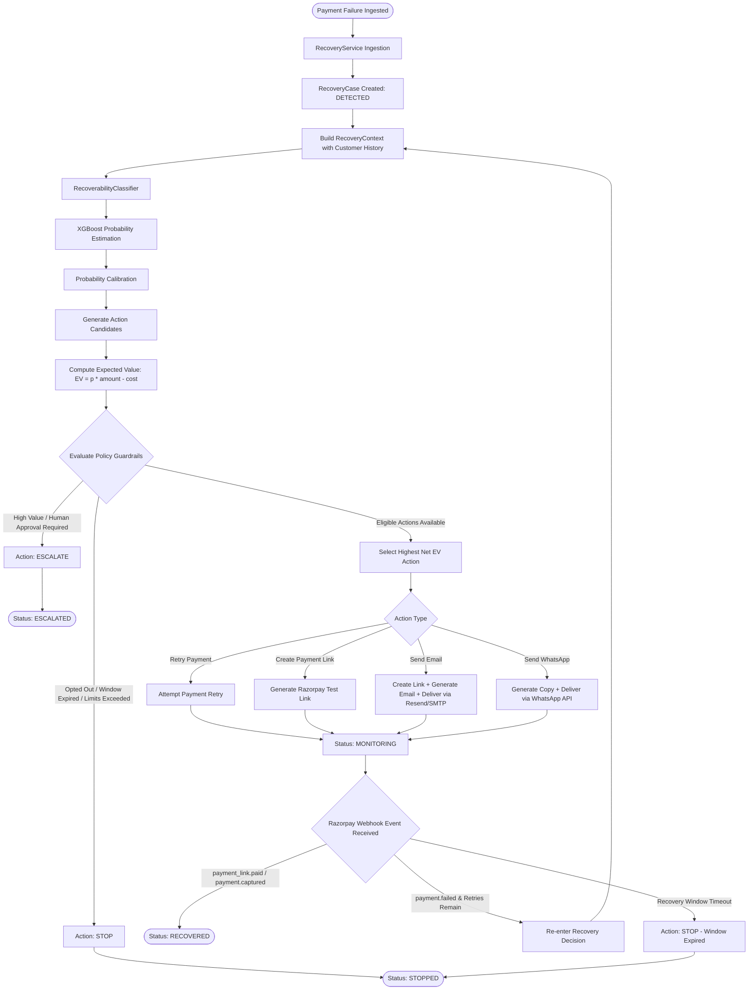
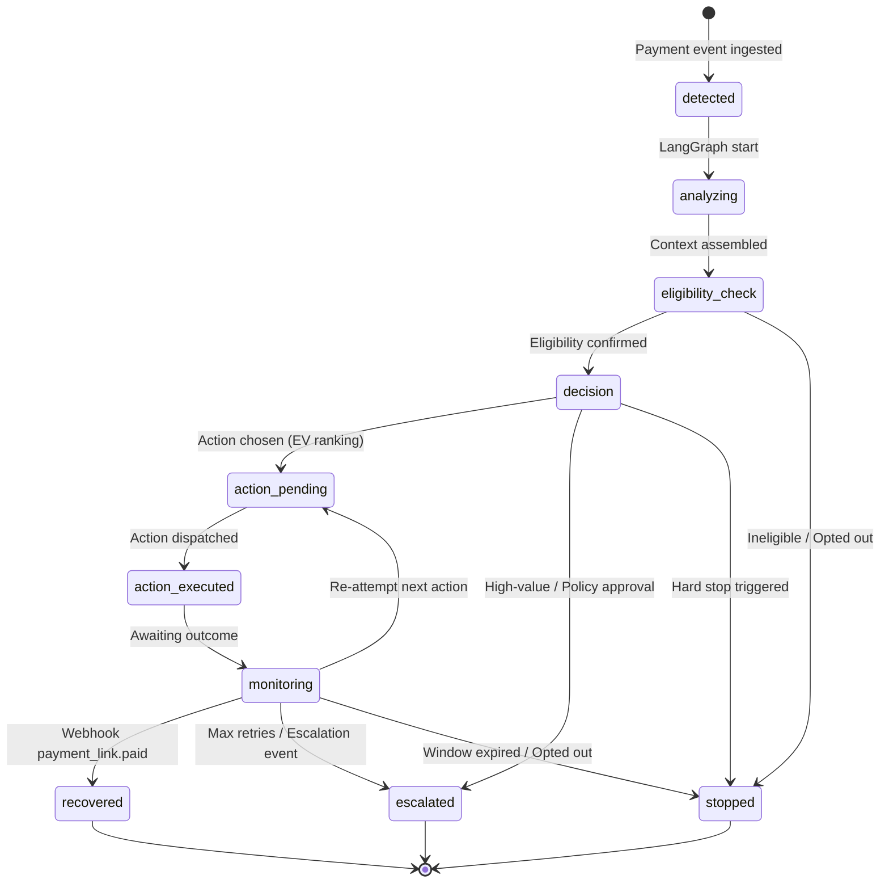
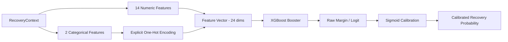
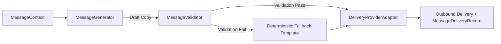
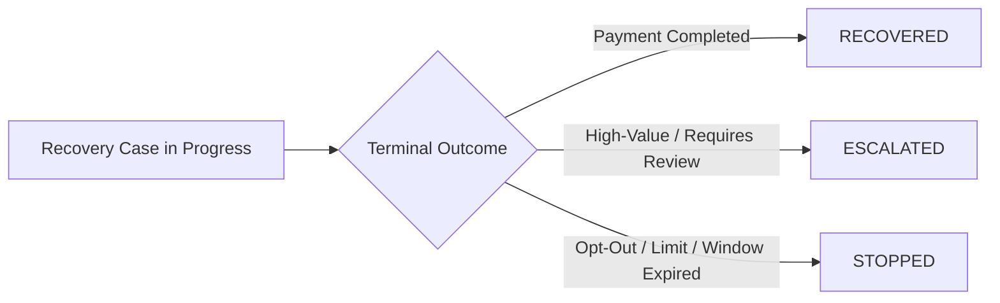
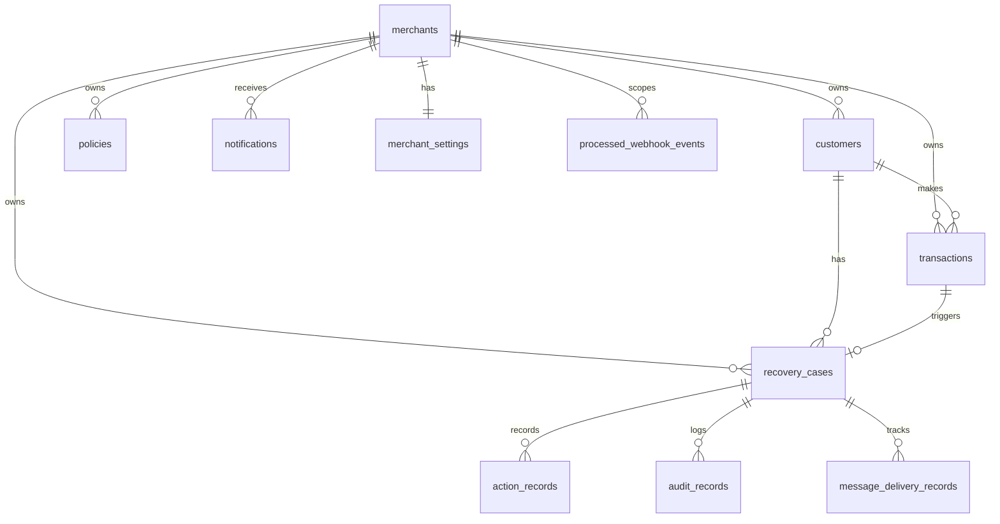

# PayBack

Autonomous, policy-bounded revenue recovery platform for digital commerce.

PayBack detects failed and abandoned payments, evaluates customer and transaction context, predicts recovery probability using a calibrated machine learning model, ranks candidate recovery actions via expected-value optimization, enforces strict merchant policy guardrails, dispatches personalized recovery messages and payment links, monitors transaction outcomes via verified webhooks, and maintains an immutable audit trail.

The backend (FastAPI) serves as the authoritative source of truth for all recovery logic, policy enforcement, and data persistence. The frontend (Next.js) provides a merchant operations dashboard for tracking recoveries, managing policies, viewing analytics, and testing recovery workflows.

---

## Table of Contents

- [Overview](#overview)
- [Problem](#problem)
- [Solution](#solution)
- [How PayBack Works](#how-payback-works)
- [System Architecture](#system-architecture)
- [Architecture Layers](#architecture-layers)
- [Recovery Workflow](#recovery-workflow)
- [State Machine](#state-machine)
- [Recovery Intelligence / ML](#recovery-intelligence--ml)
- [Decision Engine](#decision-engine)
- [Policies & Guardrails](#policies--guardrails)
- [Customer Context](#customer-context)
- [Messaging & LLM](#messaging--llm)
- [Recovery Outcomes](#recovery-outcomes)
- [Razorpay Integration](#razorpay-integration)
- [Supabase & Persistence](#supabase--persistence)
- [Multi-Tenancy & Authentication](#multi-tenancy--authentication)
- [API Documentation](#api-documentation)
- [Frontend Application](#frontend-application)
- [Deployment](#deployment)
- [Demo Access](#demo-access)
- [Local Development](#local-development)
- [Environment Variables](#environment-variables)
- [Project Structure](#project-structure)
- [Testing](#testing)
- [Security & Safety](#security--safety)
- [Current Limitations & Roadmap](#current-limitations--roadmap)

---

## Overview

In modern payment gateways, transaction failures are common: bank downtimes, customer network timeouts, authentication drops, and insufficient balance frequently disrupt otherwise high-intent checkouts. Traditional recovery approaches rely either on blunt automated retries that trigger fraud alarms or blanket promotional blasts that annoy customers.

PayBack replaces heuristic recovery with an autonomous, policy-bounded decision engine:
- Every failed or abandoned payment is evaluated in its specific historical and transaction context.
- Recovery probability is estimated using a calibrated gradient-boosted decision tree (XGBoost).
- Candidate actions are evaluated by expected value (EV = probability x amount at risk - action cost).
- Configurable merchant guardrails strictly constrain the agent: hard stops on opt-outs and expired recovery windows, escalation on high-value amounts, and policy bans on invalid retry vectors (such as direct UPI retries).
- Customer communications are generated within strict financial boundaries, validated against hallucinations or altered links, and dispatched over email (Resend / SMTP) or messaging channels (WhatsApp).
- Outcome monitoring is handled through authenticated Razorpay webhooks with idempotency guards and error mapping.

The system is designed to operate locally at zero external monetary cost using in-memory data stores, Razorpay Test Mode, and open-model LLM generation, with production support for Supabase PostgreSQL and cloud delivery APIs.

---

## Problem

Payment processing failures represent significant unrecovered revenue leakage in digital commerce:

1. **High Inherent Failure Rates**: Digital payment rails (such as UPI, cards, and net banking) routinely experience network timeouts, transient gateway errors, and bank downtime. Up to 15-30% of payment attempts can fail due to technical and non-technical reasons.
2. **Context Blindness**: Standard gateway failure responses treat a first-time buyer with an expired card identically to a loyal customer who encountered a 3-second bank gateway timeout.
3. **Harmful Retries**: Repeatedly submitting failed transactions against payment rails without customer intervention triggers fraud blocks, incurs processing fees, and damages merchant gateway reputations (especially on rails like UPI that reject direct server retries).
4. **Disjointed Communication**: Recovery notifications sent hours later via uncoordinated marketing channels lose high-intent conversion windows and frequently provide stale or broken payment links.
5. **Lack of Auditability**: Finance and operations teams rarely have visibility into why a particular transaction was retried, messaged, escalated to support, or abandoned.

---

## Solution

PayBack provides a systematic, closed-loop recovery architecture:

- **Immediate Ingestion**: Captures transaction failures directly via payment events or gateway webhooks.
- **Context Assembly**: Queries customer tenure, prior transaction volume, historical success rate, and past recovery performance, enforcing strict temporal boundaries to prevent data leakage.
- **Deterministic Classification**: Categorizes recoverability into actionable tiers (Likely Recoverable, Unlikely Recoverable, Non-Recoverable) based on failure codes and customer opt-out status.
- **ML Probability Estimation**: Calculates calibrated recovery probability through an XGBoost model using 24 encoded features.
- **Expected-Value Action Selection**: Scores permissible recovery interventions by net expected financial return while factoring in marginal action costs.
- **Authoritative Merchant Guardrails**: Overrides ranking whenever hard stop conditions (opt-out, maximum retries reached, maximum messages sent, window expired) or escalation triggers (high-value thresholds, human approval policies) are met.
- **Personalized & Validated Outreach**: Uses an LLM to generate customer-appropriate notification copy, verified by a strict validation layer that guarantees exact payment amounts, correct payment links, and mandatory opt-out instructions.
- **Webhook Outcome Loop**: Closes the loop when the customer completes payment through the generated Razorpay Test Mode link, transitioning the recovery case to a terminal recovered status and recording revenue saved.
- **Comprehensive Audit Trail**: Records every state transition, decision reason, probability calculation, and external interaction in an immutable chronological ledger.

---

## How PayBack Works

```
Payment Event / Webhook
         |
         v
1. Ingest Transaction & Customer
         |
         v
2. Assemble Historical Context (Strict Temporal Isolation)
         |
         v
3. Classify Recoverability & Run XGBoost Inference
         |
         v
4. Generate Candidates & Compute Expected Value (EV)
         |
         v
5. Enforce Policy Guardrails (Hard Stops & Escalations)
         |
         v
6. Select Best Action & Generate Explanation
         |
         v
7. Execute Action (Create Payment Link & Dispatch Message)
         |
         v
8. Monitor Status & Await Webhook Result
         |
         v
9. Finalize Outcome (Recovered, Escalated, or Stopped)
         |
         v
10. Persist State & Append to Audit Ledger
```

---

## System Architecture



### Explanation of Architecture Layers

1. **Merchant Frontend Layer**: Next.js 16 application written in React 19 and Tailwind CSS v4. Features responsive management views for recoveries, customer profiles, merchant policies, and analytics. It communicates with the backend through a typed API client that seamlessly switches between live FastAPI endpoints and offline mock datasets via `NEXT_PUBLIC_DATA_MODE`.
2. **Presentation & API Layer**: FastAPI application mounting modular v1 endpoints under `/api/v1`. Enforces RFC 7519 JWT tenant security, correlation ID tracing via middleware, structured error responses, and webhook signature validation.
3. **Application & Service Layer**: `RecoveryService` coordinates end-to-end recovery workflows, binds repositories to the agent, handles payment event ingestion, and records immutable audit records for every lifecycle milestone.
4. **Agent & State Machine Layer**: LangGraph workflow governing execution state transitions: `analyze -> check_eligibility -> decide -> execute_action -> monitor`. State changes are strictly checked against transition rules to prevent invalid or backward states.
5. **Intelligence Layer**: Combines deterministic rule-based recoverability classification with statistical machine learning. An XGBoost binary classifier evaluates 24 engineered features to predict recovery likelihood, passed through a sigmoid-on-logit calibrator.
6. **Decision & Policy Layer**: `ActionScorer` computes net Expected Value for permissible actions. The `PolicyGuardrails` engine enforces merchant constraints (retry limits, message caps, recovery window expiry, high-value escalation thresholds, UPI retry prohibitions) that strictly override ML ranking.
7. **Communication Layer**: Decouples message generation from delivery. `MessageGenerator` drafts channel-specific text using open models, while `MessageValidator` validates content to eliminate unparsed templates, confirm exact financial amounts, verify payment links, and inject mandatory opt-out text. Messages are delivered via `DeliveryProviderAdapter` (Resend, SMTP, WhatsApp, or Mock).
8. **External Integration Layer**: Interacts exclusively with Razorpay Test Mode (`rzp_test_*`), creating simulated Orders and Payment Links. Receives payment confirmation events via HMAC-SHA256 verified webhooks.
9. **Persistence & Audit Layer**: Repository abstraction supporting zero-cost in-memory execution or Supabase PostgreSQL via PostgREST. Tracks 10 domain entities and maintains a complete, append-only audit trail for compliance and explainability.

---

## Recovery Workflow



---

## State Machine

The recovery lifecycle is governed by a formal state machine defined in `backend/app/core/state_machine.py`. Illegal transitions raise `InvalidTransitionError` (HTTP 400).



### State Definitions

| State | Category | Description |
|-------|----------|-------------|
| `detected` | Transient | Case instantiated from a payment event. Initial state. |
| `analyzing` | Working | Ingestion analysis and context assembly. |
| `eligibility_check` | Working | Deterministic rule checking for opt-out, tenure, and eligibility. |
| `decision` | Working | Decision engine evaluates ML probability, EV ranking, and policies. |
| `action_pending` | Working | Chosen recovery action is prepared for execution. |
| `action_executed` | Working | External action dispatched (link generated, message sent). |
| `monitoring` | Working | Case awaiting customer payment confirmation or webhook callback. |
| `recovered` | **Terminal** | Payment confirmed via webhook. Recovered revenue recorded. |
| `escalated` | **Terminal** | High value or policy constraint routed case to merchant staff. |
| `stopped` | **Terminal** | Recovery halted due to policy boundaries, customer opt-out, or window expiry. |

---

## Recovery Intelligence / ML

PayBack incorporates a machine learning model to estimate the recovery likelihood of failed transactions, replacing rigid heuristic rules with data-driven probability estimation.

### Model Overview

- **Model Architecture**: Gradient Boosted Decision Trees (`XGBClassifier`) implemented via XGBoost.
- **Model Identifier**: `payback-recovery-v3`
- **Output Target**: `P(recovered = 1 | decision-time context)` as a continuous probability `p in [0.0, 1.0]`.
- **Calibration Method**: Lightweight sigmoid-on-logit calibration fitted on validation set logits to ensure probabilities represent empirical recovery rates.
- **Serialization**: Model stored in native JSON format (`ml/models/payback_xgboost.json`), with calibration parameters and feature schemas stored as plain JSON (`ml/artifacts/calibration.json`, `ml/artifacts/feature_schema.json`).

### Synthetic Training Data Disclosure

The machine learning model was trained and evaluated on an open synthetic dataset of **100,000 generated recovery records** (`ml/data/synthetic_recovery_cases.csv`). 

- The dataset simulates real-world recovery dynamics, including payment method reliability, error code recoverability, customer transaction history, and checkout intent signals.
- The dataset is strictly synthetic; it does not contain proprietary Razorpay or live merchant customer data.
- The model is intended for demonstration, benchmarking, and architectural validation.

### Dataset Splits

| Split | Records | Purpose |
|-------|---------|---------|
| Train | 70,000 | XGBoost gradient boosting tree optimization |
| Validation | 15,000 | Hyperparameter selection and probability calibration fitting |
| Test (Held-out) | 15,000 | Final unbiased performance benchmarking |
| Manual Review Cases | 50 | Edge-case verification and qualitative validation |

### Held-Out Test Evaluation Benchmark

Evaluated on the 15,000 held-out test records:

| Model | ROC-AUC | PR-AUC | Brier Score | Log Loss | Accuracy | Precision | Recall | F1 Score |
|-------|---------|--------|-------------|----------|----------|-----------|--------|----------|
| **XGBoost (Calibrated)** | **0.8112** | **0.7407** | **0.1720** | **0.5136** | **74.19%** | **0.7004** | **0.6209** | **0.6583** |
| XGBoost (Raw) | 0.8112 | 0.7407 | 0.1721 | 0.5138 | 74.25% | 0.6983 | 0.6281 | 0.6613 |
| Logistic Regression | 0.8023 | 0.7286 | 0.1760 | 0.5241 | 72.99% | 0.6789 | 0.6171 | 0.6465 |

### Feature Engineering Pipeline

The inference adapter transforms a `RecoveryContext` into a 24-dimensional numeric feature vector:



#### Feature Schema (24 dimensions)

| Category | Features | Encoding / Formula |
|----------|----------|--------------------|
| **Transaction Attributes** | `amount`, `high_value` | Amount in INR; binary indicator (`amount >= 10,000`) |
| **Payment Rail** | `payment_method` | One-hot encoded (4 dims): `upi`, `card`, `netbanking`, `wallet` |
| **Failure Nature** | `failure_type` | One-hot encoded (6 dims): `temporary_bank_error`, `timeout`, `insufficient_funds`, `expired_instrument`, `authentication_failure`, `unknown` |
| **Customer Profile** | `customer_tenure_days`, `opted_out` | Account age in days; binary opt-out flag |
| **Historical Track Record** | `previous_transactions`, `historical_success_rate`, `previous_failures`, `previous_recoveries`, `prior_recovery_rate`, `customer_history_strength` | Prior total count, historical success ratio, prior failure count, prior recovery count, recovery ratio, log-scaled history depth (`log1p(prior_tx) / log1p(40)`) |
| **Case Progression** | `days_since_failure`, `retry_count`, `messages_sent` | Time elapsed since initial failure; current retry count; messages dispatched |
| **Checkout Intent** | `checkout_intent_score` | Fixed benchmark baseline (0.50) |

---

## Decision Engine

A machine learning prediction alone is never allowed to execute financial actions. The `DecisionEngine` (`backend/app/core/decision.py`) evaluates ML predictions alongside merchant policy guardrails.

### Decision Pipeline

```
1. Classify Recoverability Category (Rule-Based Pre-filter)
   ├── NON_RECOVERABLE -> Hard Stop
   └── LIKELY / UNLIKELY -> Proceed to ML Scoring

2. Run Calibrated ML Inference -> Base Probability (p)

3. Generate Candidate Actions & Compute Expected Value:
   Candidate Probability = Base Probability x Channel Conversion Weight
   Expected Value (EV) = Candidate Probability x Amount at Risk - Action Cost

4. Enforce Authoritative Policy Guardrails:
   ├── Opt-out flag active? -> Force STOP (Reason: opt_out)
   ├── Recovery window exceeded? -> Force STOP (Reason: window_expired)
   ├── Retries >= max_retries? -> Force STOP (Reason: max_retries)
   ├── Messages >= max_messages? -> Force STOP (Reason: max_messages)
   ├── Amount >= high_value_threshold? -> Force ESCALATE (Reason: high_value)
   └── Human approval required by policy? -> Force ESCALATE (Reason: approval_required)

5. Action Selection:
   Filter out ineligible actions (e.g. UPI direct retry prohibited by policy).
   Select candidate with highest net Expected Value among eligible actions.

6. Generate Explainable Audit Rationale via ExplanationEngine
```

### Action Candidate Economics

Action scoring accounts for marginal channel cost and typical conversion efficiency:

| Recovery Action | Channel Weight | Default Cost (INR) | Policy Rules |
|-----------------|----------------|--------------------|--------------|
| `create_payment_link` | 1.00 | ₹5.00 | Primary recovery route for failed checkouts |
| `send_email` | 0.70 | ₹0.20 | Generates payment link + sends email via Resend/SMTP |
| `send_whatsapp` | 0.90 | ₹1.00 | Requires phone number + mandatory opt-out text |
| `retry_payment` | 0.85 | ₹2.00 | **Strictly blocked for UPI**; allowed for card/netbanking |
| `escalate` | 0.50 | ₹15.00 | High-value accounts or human review triggers |
| `stop` | 0.00 | ₹0.00 | Terminal exit; zero cost |

---

## Policies & Guardrails

Merchant policies provide deterministic boundaries that the autonomous agent cannot cross. Configured via the merchant dashboard or `/api/v1/policies`.

| Guardrail | Default Value | Enforcement Logic |
|-----------|---------------|-------------------|
| `maximum_retries` | 3 | Halts automated recovery if retry attempts reach limit |
| `maximum_messages` | 3 | Halts outbound messaging to prevent customer spam |
| `recovery_window_hours` | 72 hours | Transitions case to `STOPPED` once elapsed time exceeds window |
| `high_value_threshold` | ₹10,000 | Automatically diverts case to `ESCALATED` for human review |
| `human_approval_required` | `false` | When enabled, prevents all automated execution and escalates |
| `upi_direct_retry_prohibited` | Enforced | Prohibits server-side retry of failed UPI payments |
| `opt_out_honor` | Mandatory | Opted-out customers immediately trigger hard `STOP` |

---

## Customer Context

The intelligence engine computes customer profile features using historical transactions and recovery records (`backend/app/services/ml/customer_history.py`).

### Temporal Integrity Rule

To eliminate data leakage, customer history calculations strictly observe a temporal cutoff:

```python
reference_dt = transaction.created_at
```

Only transactions, failures, and recovery cases created **strictly before** `reference_dt` are incorporated into historical features. The current failed transaction is excluded from its own historical baseline.

---

## Messaging & LLM

PayBack decouples copy generation from message delivery.



### LLM Providers

Configured via `LLM_PROVIDER`:
- **Ollama** (`LLM_PROVIDER=ollama`): Default local inference using `qwen2.5:3b`. Zero external network call, zero API cost.
- **Hugging Face** (`LLM_PROVIDER=huggingface`): Cloud inference using `mistralai/Mistral-7B-Instruct-v0.2` via Hugging Face Inference API.
- **Mock** (`LLM_PROVIDER=mock`): Deterministic templates for offline test suites.

### Strict Validation Layer (`MessageValidator`)

All LLM output must pass automated validation before dispatch:
- **Placeholder Rejection**: Fails if unparsed tokens (`[...]`, `{{...}}`, `TODO`, `TBD`) exist.
- **Financial Exactness**: Verifies that any currency amounts mentioned match the transaction amount exactly.
- **Payment Link Verification**: Confirms that any URL present matches the generated Razorpay payment link exactly. Invented or modified links are rejected.
- **Mandatory Opt-out Text**: Automatically appends `"Reply STOP to opt out."` to WhatsApp messages if omitted.
- **Deterministic Fallback**: If validation fails, the system discards the LLM text and delivers a deterministic template.

### Messaging Delivery Providers

Configured via `MESSAGE_DELIVERY_PROVIDER`:
- **Resend** (`resend`): Cloud email delivery via Resend API (`RESEND_API_KEY`).
- **SMTP** (`smtp`): Direct email transmission via standard SMTP (e.g. Gmail App Password).
- **WhatsApp** (`whatsapp`): Cloud messaging via WhatsApp Business Cloud API.
- **Mock** (`mock`): In-memory simulation logging delivery attempts without external calls.

Every delivery attempt is persisted as a `MessageDeliveryRecord`.

---

## Recovery Outcomes

Every recovery case ends in one of three terminal states:



1. **Recovered** (`status = recovered`, `outcome = recovered`): Customer completes payment via payment link. Webhook validates signature, confirms capture, records `amount_recovered`, and emits audit entries.
2. **Escalated** (`status = escalated`, `outcome = escalated`): Amount exceeds `high_value_threshold` or merchant policy requires human review. Dispatched to merchant dashboard queue.
3. **Stopped** (`status = stopped`, `outcome = stopped`): Customer opted out, maximum retries or messages were reached, or the 72-hour recovery window expired.

---

## Razorpay Integration

PayBack integrates with **Razorpay Test Mode only**.

### Strict Test Mode Safeguards

- Supported keys must start with the prefix `rzp_test_`.
- Live keys (`rzp_live_`) are actively rejected during configuration loading and provider instantiation via `LiveKeyForbiddenError`.
- Live credit cards and real bank accounts are never charged.
- When test credentials are not provided, `StubPaymentProvider` simulates the workflow locally.

### Payment Link Lifecycle

1. `RazorpayPaymentProvider.create_payment_link()` generates a Razorpay Order and Payment Link with receipt ID `payback_<transaction_id>`.
2. The payment link URL (`external_ref`) is returned to the recovery engine and embedded into validated customer communications.
3. The customer opens the test payment link and completes the simulated payment.

### Webhook Verification & Error Code Mapping

Webhook endpoint: `POST /api/v1/events/webhook/razorpay`

- **HMAC-SHA256 Verification**: Verifies incoming payload against `RAZORPAY_WEBHOOK_SECRET`.
- **Idempotency Guard**: Checks `processed_webhook_events` before executing state updates. Duplicate deliveries return HTTP 200 with `is_duplicate: true`.
- **Error Code Mapping**: Converts cryptic gateway error codes into clear, human-readable explanations via `RAZORPAY_ERROR_MAPPING`:
  - `BAD_REQUEST_ERROR` -> *"Invalid payment details provided"*
  - `INSUFFICIENT_FUNDS` -> *"Insufficient funds in your account"*
  - `CARD_EXPIRED` -> *"Card has expired"*
  - `BANK_DOWN` -> *"Bank services are temporarily unavailable"*
  - `GATEWAY_ERROR` -> *"Payment gateway error, please try again"*

---

## Supabase & Persistence

PayBack provides full persistence abstraction across 10 core domain entities, supporting **In-Memory Repositories** (default) and **Supabase PostgreSQL** via PostgREST.

### Database Entities



### Table Schema Summary

| Table | Purpose | Primary Key | Key Relations |
|-------|---------|-------------|---------------|
| `merchants` | Tenant accounts and workspace profiles | `id` (TEXT) | Parent of tenant resources |
| `merchant_settings` | Notification and workflow preferences | `id` (TEXT) | `merchant_id -> merchants.id` |
| `customers` | End-customers with opt-out flags | `id` (UUID/TEXT) | `merchant_id -> merchants.id` |
| `transactions` | Payment records, amounts, and failure codes | `id` (UUID/TEXT) | `customer_id -> customers.id`, `merchant_id` |
| `recovery_cases` | Active and historical recovery workflows | `id` (UUID/TEXT) | `transaction_id`, `customer_id`, `merchant_id` |
| `action_records` | History of executed recovery interventions | `id` (UUID/TEXT) | `recovery_case_id -> recovery_cases.id` |
| `audit_records` | Append-only chronological audit trail | `id` (UUID/TEXT) | `recovery_case_id -> recovery_cases.id` |
| `policies` | Merchant-defined recovery guardrails | `id` (UUID/TEXT) | `merchant_id -> merchants.id` |
| `message_delivery_records` | Outbound email and WhatsApp delivery logs | `id` (TEXT) | `recovery_case_id`, `customer_id` |
| `notifications` | In-app merchant alerts | `id` (TEXT) | `merchant_id -> merchants.id` |
| `processed_webhook_events` | Webhook idempotency ledger | `id` (TEXT) | Unique `(provider, provider_event_id)` |

### SQL Migrations

Located under `database/`:
- `database/schema/supabase.sql`: Core PostgreSQL tables and role permissions.
- `database/supabase/migrations/001_phase4_production_readiness.sql`: Multi-tenancy columns, settings, message logs, and RLS policies.
- `database/supabase/migrations/002_supabase_grants_and_legacy_reconciliation.sql`: Role grants for service role and authenticated access.
- `database/supabase/migrations/003_finalize_historical_merchant_dataset.sql`: Demo data seed reconciliation.
- `database/supabase/migrations/004_add_razorpay_transaction_fields.sql`: Added `failure_code`, `razorpay_order_id`, and `razorpay_payment_id` with lookup indexes.

---

## Multi-Tenancy & Authentication

PayBack enforces merchant tenant isolation across the application stack:

1. **Authentication**: RFC 7519 standard JWT tokens signed with HMAC-SHA256 (`HS256`).
2. **FastAPI Dependency**: Protected endpoints resolve tenant context via `Depends(get_current_merchant)`.
3. **Repository Scoping**: Queries filter by `merchant_id` at the repository layer.
4. **Development Fallback**: In test mode with `AUTH_ENABLED=false`, unauthenticated calls resolve to a default demo merchant (`merchant_default`).
5. **Database RLS**: Row Level Security policies defined on PostgreSQL tables ensure multi-tenant protection.

---

## API Documentation

Base URL: `http://localhost:8000`  
Interactive OpenAPI documentation: `http://localhost:8000/docs`

### Authentication (`/api/v1/auth`)

| Method | Path | Description | Auth |
|--------|------|-------------|------|
| `POST` | `/api/v1/auth/register` | Register new merchant workspace and receive JWT | Public |
| `POST` | `/api/v1/auth/login` | Sign in with email and retrieve merchant JWT session | Public |
| `GET` | `/api/v1/auth/me` | Fetch authenticated merchant profile | Bearer JWT |

### Payments & Ingestion (`/api/v1/payments`, `/api/v1/events`)

| Method | Path | Description | Auth |
|--------|------|-------------|------|
| `POST` | `/api/v1/payments/create` | Create Razorpay Test payment link for existing customer | Bearer JWT |
| `POST` | `/api/v1/payments/create-with-customer` | Create customer and payment link in single call | Bearer JWT |
| `GET` | `/api/v1/payments/transaction/{id}` | Retrieve transaction status and Razorpay details | Bearer JWT |
| `GET` | `/api/v1/payments/customer/{id}` | List payments for a specific customer | Bearer JWT |
| `POST` | `/api/v1/events/payment` | Ingest failed payment and create recovery case | Bearer JWT |
| `POST` | `/api/v1/events/webhook/razorpay` | Razorpay webhook receiver (HMAC-SHA256 verified) | Signature Header |

### Recoveries (`/api/v1/recoveries`)

| Method | Path | Description | Auth |
|--------|------|-------------|------|
| `GET` | `/api/v1/recoveries` | List recovery cases for merchant | Bearer JWT |
| `GET` | `/api/v1/recoveries/{id}` | Fetch recovery case detail by ID | Bearer JWT |
| `POST` | `/api/v1/recoveries` | Trigger recovery workflow execution for a case | Bearer JWT |
| `GET` | `/api/v1/recoveries/{id}/actions` | Fetch action history for a recovery case | Bearer JWT |
| `GET` | `/api/v1/recoveries/{id}/timeline` | Fetch chronological audit trail for a case | Bearer JWT |
| `GET` | `/api/v1/recoveries/{id}/messages` | Fetch message delivery records for a case | Bearer JWT |

### Customers (`/api/v1/customers`)

| Method | Path | Description | Auth |
|--------|------|-------------|------|
| `GET` | `/api/v1/customers` | List merchant customers | Bearer JWT |
| `GET` | `/api/v1/customers/{id}` | Fetch customer profile and recovery summary | Bearer JWT |
| `GET` | `/api/v1/customers/{id}/payments` | Fetch all transaction history for customer | Bearer JWT |
| `GET` | `/api/v1/customers/{id}/recoveries` | Fetch all recovery cases for customer | Bearer JWT |

### Dashboard & Analytics (`/api/v1/dashboard`)

| Method | Path | Description | Auth |
|--------|------|-------------|------|
| `GET` | `/api/v1/dashboard/summary` | Aggregate recovery metrics (recovered, rate, pipeline) | Bearer JWT |
| `GET` | `/api/v1/dashboard/trends` | Time-series recovery trend data | Bearer JWT |
| `GET` | `/api/v1/dashboard/breakdown` | Breakdown by failure reason, action, and payment rail | Bearer JWT |

### Policies & Settings (`/api/v1/policies`, `/api/v1/settings`)

| Method | Path | Description | Auth |
|--------|------|-------------|------|
| `GET` | `/api/v1/policies` | List merchant policy configurations | Bearer JWT |
| `GET` | `/api/v1/policies/active` | Retrieve active recovery guardrail policy | Bearer JWT |
| `POST` | `/api/v1/policies` | Create or update merchant recovery policy | Bearer JWT |
| `GET` | `/api/v1/settings/profile` | Retrieve merchant settings | Bearer JWT |
| `PUT` | `/api/v1/settings/profile` | Update merchant workspace settings | Bearer JWT |

### Health & Monitoring (`/health`, `/ready`)

| Method | Path | Description | Auth |
|--------|------|-------------|------|
| `GET` | `/health` | Process liveness check | Public |
| `GET` | `/ready` | Subsystem readiness check (Supabase, Razorpay, LLM) | Public |

---

## Frontend Application

Stack: **Next.js 16**, **React 19**, **Tailwind CSS v4**, **shadcn/ui**.

### Views & Capabilities

- **Overview Dashboard**: Displays lifetime recovered value, recovery success rate, open pipeline value, and volume trend graphs.
- **Recoveries Queue**: Filterable case list showing probability score, recoverability tier, current status badge, and recommended action. Includes an inspection drawer with decision rationale, EV breakdown, message preview, and chronological audit timeline.
- **Customers Directory**: Customer list with lifetime spend, recovery history, and an alert section highlighting **Recent Payment Failures** with direct links to active recovery cases.
- **Policies Configuration**: Direct controls for configuring retry limits, message caps, recovery window hours, high-value thresholds, and human review requirements.
- **Create Payment Modal**: Form enabling merchants to generate a Razorpay Test Mode payment link with custom customer details to test the failure and recovery flow.
- **Dark & Light Mode**: Complete theme system with persistence in `localStorage`.

### Dual-Mode Architecture

The frontend operates in two configurable data modes via `NEXT_PUBLIC_DATA_MODE`:
1. **API Mode (`NEXT_PUBLIC_DATA_MODE=api`)**: Connects to the live FastAPI backend over HTTP, attaching Bearer JWT tokens from the session.
2. **Mock Mode (`NEXT_PUBLIC_DATA_MODE=mock`)**: Operates standalone with local in-memory datasets for offline demonstrations.

---

## Deployment

PayBack is deployed and accessible online:

- **Deployed Application URL**: [https://paybackv1.netlify.app](https://paybackv1.netlify.app)
- **Deployment Platform**: Netlify (Frontend) configured via `netlify.toml`

---

## Demo Access

Public demonstration credentials for reviewing pre-loaded merchant data and testing the platform:

```
Demo Login:    admin@payback.io
Demo Password: demo-password
```

On the sign-in page, click **"Use demo account"** to immediately populate credentials and access the dashboard.

---

## Local Development

### Prerequisites

- Python 3.11+
- Node.js 18+ (Node 20+ recommended)
- Optional: Ollama (for local LLM message generation)

### 1. Repository Setup

```bash
git clone https://github.com/Samarjamal326/PayBack.git
cd PayBack
```

### 2. Backend Setup

```bash
# Create and activate virtual environment
python -m venv venv
# Windows:
.\venv\Scripts\activate
# Linux/macOS:
source venv/bin/activate

# Install dependencies
pip install -r backend/requirements.txt

# Install ML inference dependencies
pip install xgboost numpy

# Configure environment
cp .env.example .env

# Run FastAPI backend server
cd backend
python -m uvicorn app.main:app --reload --host 0.0.0.0 --port 8000
```

The API will be live at `http://localhost:8000`. Swagger documentation is available at `http://localhost:8000/docs`.

### 3. Frontend Setup

In a new terminal window:

```bash
cd frontend

# Install Node dependencies
npm install

# Configure environment
cp .env.example .env.local

# Start Next.js development server
npm run dev
```

The merchant dashboard will be accessible at `http://localhost:3000`.

### 4. Optional Service Configurations

- **Local LLM (Ollama)**: Install Ollama and pull the model:
  ```bash
  ollama pull qwen2.5:3b
  ```
  Set `LLM_PROVIDER=ollama` in `.env`.
- **Razorpay Test Mode**: Add your test credentials to `.env`:
  ```env
  RAZORPAY_KEY_ID=rzp_test_YourKeyId
  RAZORPAY_KEY_SECRET=YourKeySecret
  RAZORPAY_WEBHOOK_SECRET=YourWebhookSecret
  ```
- **Supabase PostgreSQL**: Run the SQL files in `database/schema/supabase.sql` and `database/supabase/migrations/` in your Supabase SQL editor. Add `SUPABASE_URL` and `SUPABASE_SERVICE_ROLE_KEY` to `.env`, and set `DATABASE_MODE=supabase`.

---

## Environment Variables

| Variable | Description | Default | Required? |
|----------|-------------|---------|-----------|
| `PAYBACK_ENV` | Runtime environment (`development`, `production`) | `development` | No |
| `DATABASE_MODE` | Repository backend (`memory`, `supabase`) | `memory` | No |
| `LOG_LEVEL` | Logging verbosity (`DEBUG`, `INFO`, `WARNING`) | `INFO` | No |
| `SUPABASE_URL` | Supabase project URL | `""` | Optional |
| `SUPABASE_ANON_KEY` | Supabase anonymous API key | `""` | Optional |
| `SUPABASE_SERVICE_ROLE_KEY` | Supabase privileged service role key | `""` | Optional |
| `RAZORPAY_KEY_ID` | Razorpay API key ID (must start with `rzp_test_`) | `""` | Optional |
| `RAZORPAY_KEY_SECRET` | Razorpay API secret key | `""` | Optional |
| `RAZORPAY_WEBHOOK_SECRET` | Secret for HMAC-SHA256 webhook signature check | `""` | Optional |
| `MESSAGE_DELIVERY_PROVIDER` | Channel provider (`mock`, `resend`, `smtp`, `whatsapp`) | `resend` | No |
| `RESEND_API_KEY` | API key for Resend email service | `""` | Optional |
| `RESEND_FROM_EMAIL` | Sender address for Resend emails | `onboarding@resend.dev` | No |
| `SMTP_HOST` / `SMTP_PORT` | SMTP server host and port | `""`, `587` | Optional |
| `SMTP_USER` / `SMTP_PASSWORD` | SMTP authentication credentials | `""`, `""` | Optional |
| `WHATSAPP_API_URL` / `TOKEN` | WhatsApp Cloud API endpoint and bearer token | `""`, `""` | Optional |
| `LLM_PROVIDER` | LLM generator (`ollama`, `huggingface`, `mock`) | `ollama` | No |
| `OLLAMA_BASE_URL` | Local Ollama HTTP URL | `http://localhost:11434` | No |
| `OLLAMA_MODEL` | Ollama model identifier tag | `qwen2.5:3b` | No |
| `HUGGINGFACE_API_KEY` | Hugging Face API token for cloud inference | `""` | Optional |
| `AUTH_ENABLED` | Require JWT on protected API endpoints | `false` | No |
| `JWT_SECRET_KEY` | Secret key for signing HS256 JWT tokens | Development string | Change in prod |
| `NEXT_PUBLIC_API_URL` | Backend URL for frontend client | `http://localhost:8000` | No |
| `NEXT_PUBLIC_DATA_MODE` | Frontend data mode (`api` or `mock`) | `api` | No |

---

## Project Structure

```
PayBack/
├── backend/
│   ├── app/
│   │   ├── agent/             # LangGraph workflow, nodes, and state machine
│   │   ├── api/               # FastAPI modular routers (/v1) & middleware
│   │   │   └── v1/            # auth, dashboard, customers, recoveries, payments, policies
│   │   ├── core/              # Decision engine, state machine, action scoring, auth
│   │   ├── evaluation/        # Synthetic benchmark generation & strategy simulation
│   │   ├── models/            # Pydantic v2 domain schemas and enums
│   │   ├── repositories/      # In-memory and Supabase REST data access adapters
│   │   ├── services/          # Recovery orchestration, Razorpay, ML, LLM, messaging
│   │   │   ├── actions/       # Action executor, Razorpay provider, stubs
│   │   │   ├── llm/           # Ollama, Hugging Face, Mock, and MessageValidator
│   │   │   ├── messaging/     # Resend, SMTP, WhatsApp, and Mock delivery adapters
│   │   │   ├── ml/            # XGBoost inference, feature adapter, customer history
│   │   │   └── razorpay/      # Webhook processor and error code mapping
│   │   ├── config.py          # Pydantic BaseSettings environment configuration
│   │   └── main.py            # FastAPI application entry point
│   ├── scripts/               # Integration verification and test scripts
│   └── tests/                 # Comprehensive pytest test suites (237 tests)
├── database/
│   ├── schema/                # Supabase base PostgreSQL schema
│   └── supabase/migrations/   # Migrations 001-004 (multi-tenancy, grants, RZP fields)
├── frontend/
│   ├── app/                   # Next.js 16 App Router pages
│   ├── components/            # Dashboard views, modals, and shadcn UI primitives
│   │   └── payback-app.tsx    # Merchant dashboard views and navigation shell
│   ├── lib/
│   │   ├── api/               # Typed API client services (dual-mode api/mock)
│   │   └── auth-session.ts    # Session and JWT token storage
│   └── package.json
├── ml/
│   ├── artifacts/             # Calibration params, feature schema, model metadata
│   ├── data/                  # Synthetic recovery training dataset (100k rows)
│   ├── models/                # Trained XGBoost booster JSON (payback_xgboost.json)
│   └── notebooks/             # Model training and benchmark evaluation notebook
├── docs/                      # Architecture notes, setup guides, and issue reports
├── netlify.toml               # Netlify production build configuration
├── pyproject.toml             # Python package configuration
└── .env.example               # Environment template
```

---

## Testing

The test suite covers decision logic, state transitions, ML feature pipelines, probability protocols, LLM validators, Razorpay safety, webhook signature verification, and API multi-tenancy.

- **Total Collected Tests**: **237 tests** across 32 test files (verified via `pytest --collect-only`).

```bash
# Run test suite from repository root
python -m pytest backend/tests -v

# Run specific functional test categories
python -m pytest backend/tests/test_decision.py          # Decision engine & policy rules
python -m pytest backend/tests/test_ml_integration.py    # XGBoost inference & feature adapter
python -m pytest backend/tests/test_customer_history.py  # Temporal customer history queries
python -m pytest backend/tests/test_message_validator.py # LLM sanitization & validation
python -m pytest backend/tests/test_webhook_endpoint.py  # Razorpay webhooks & idempotency
python -m pytest backend/tests/test_phase4_tenant_isolation.py # Multi-tenant isolation
```

---

## Security & Safety

- **Zero-Cost Safety Guarantee**: Only Razorpay Test Mode keys (`rzp_test_`) are permitted. Live credentials (`rzp_live_`) trigger immediate startup exceptions (`LiveKeyForbiddenError`).
- **Webhook Authentication**: All Razorpay webhooks are validated using HMAC-SHA256 signature verification before processing.
- **Idempotency Protection**: Every webhook delivery ID is tracked in `processed_webhook_events` to prevent duplicate state transitions.
- **Bounded Autonomous Execution**: Recovery actions are bounded by merchant guardrails. High-value transactions automatically escalate to human operators.
- **PII & Link Verification**: The LLM is restricted from inventing URLs or altering financial amounts; all generated copy passes through `MessageValidator`.
- **Secret Redaction**: Logging filters automatically sanitize Razorpay secret keys, Bearer tokens, and sensitive headers from console logs.
- **Multi-Tenant Scoping**: All API queries are filtered by merchant identifier to prevent cross-tenant data leakage.

---

## Current Limitations & Roadmap

### Current Limitations

- **Synthetic ML Training**: The current XGBoost model was trained on 100,000 synthetic records. It is calibrated for synthetic distributions and has not been fine-tuned on live merchant payment outcomes.
- **Checkout Intent Telemetry**: The `checkout_intent_score` feature is currently assigned a static baseline (0.50) due to lack of client-side checkout telemetry.
- **Background Execution**: Background recovery operations currently execute via an in-memory thread pool (`InMemoryBackgroundExecutor`). Process restarts will drop active in-flight worker tasks.
- **Authentication**: While JWT verification is enforced on v1 routes, password verification currently relies on demo account credentials rather than an external identity provider.

### Roadmap

- [ ] Connect distributed durable queue (Redis / Celery) for persistent asynchronous background execution.
- [ ] Implement client-side checkout intent telemetry to replace static intent placeholders.
- [ ] Fine-tune ML recovery models on real-world merchant conversion data.
- [ ] Add WhatsApp template message pre-registration management in the merchant dashboard.
- [ ] Expand gateway provider adapters to support Stripe and Cashfree test modes.
